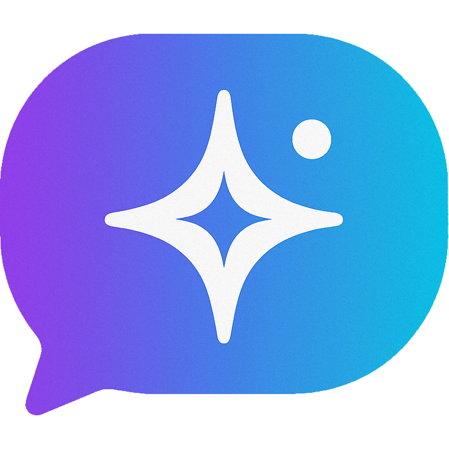

<p align="center">
  
</p>

# Mia Agent

AI Interview Agent - An intelligent interviewing system using AI to conduct automated interviews.

## Project Overview

Mia Agent provides a minimalist chat interface for users to interact with an AI conducting structured interviews. The system features a conversational AI that guides interviews with dynamic questioning based on predefined topics and language settings.

## Features

- **AI-Powered Interviews**: Utilizes AI models through the Prism library to conduct natural-feeling interviews
- **Multi-language Support**: Configure interviews in different languages
- **Topic-based Structure**: Organize interviews around configurable topics
- **Session Management**: Track and store interview sessions with complete conversation history
- **Real-time Chat Interface**: Clean, modern UI with real-time message display
- **Admin Dashboard**: Comprehensive admin panel to manage interviews and view results
- **Interview Analytics**: Summarize and extract key information from completed interviews

## Getting Started

### Prerequisites
- PHP 8.2 or higher
- Composer
- Node.js and NPM

### Installation
1. Clone this repository
2. Install PHP dependencies:
   ```bash
   composer install
   ```
3. Install JavaScript dependencies:
   ```bash
   npm install
   ```
4. Copy `.env.example` to `.env` and configure your environment variables
5. Generate application key:
   ```bash
   php artisan key:generate
   ```
6. Run database migrations:
   ```bash
   php artisan migrate
   ```
7. Build frontend assets:
   ```bash
   npm run build
   ```

### Development
To start the development server:
```bash
composer run dev
```

### Testing
Run tests with:
```bash
composer run test
```
